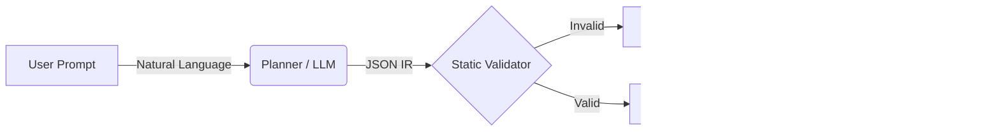

# AGX


> **Live Demo:** [agx.run](https://agx.run)
> 
> **Note:** This repository is a public snapshot of the AGX core engine. Active development occurs in a private repository to maintain commercial IP separation. This snapshot is provided for architectural review and demo purposes.

**AGX** is a deterministic compiler that translates natural language into verifiable Terraform. It constrains LLM output to a strict registry of predefined templates, eliminating the syntax errors and hallucinations common in generative approaches.

## The Concept

Standard AI agents write code probabilistically. AGX generates code deterministically by validating the plan structure before a single line of HCL is synthesized.

| Standard LLM Approach | AGX Compiler Approach |
| :--- | :--- |
| **Probabilistic:** "Hopefully this syntax is right." | **Deterministic:** Syntax is guaranteed by a static registry. |
| **Hallucinations:** Invents non-existent arguments. | **Type Safety:** Validates args against Python signatures. |
| **Black Box:** Hard to debug or audit. | **Auditable:** Compiles to an intermediate Python artifact. |

## Architecture

AGX implements a linear pipeline where the LLM functions as an untrusted planner. Its output is gated by a strict validator and only passed to the deterministic compiler if verified.



## Repository Structure

* `agx/`: Core engine.
  * `core.py`: Main orchestrator connecting the pipeline stages.
  * `llm_openai.py`: Generate JSON using `gpt-4.1-nano`.
  * `planner.py`: Converts JSON object to list.
  * `compiler.py`: Synthesizes a valid Python script using `inspect.getsource`.
  * `validate_plan.py`: Enforces strict type safety and parameter existence against the registry.
  * `registries/devops_test.py`: A demo registry focused on basic AWS infrastructure.
* `agx_backend/`: FastAPI service exposing engine.
* `agx_frontend/`: Next.js (React) interface.

## Quick Start

### 1. Install dependencies
```
pip install -r requirements.txt
```

### 2. Run the test suite 
```
python -m pytest agx/tests/
```

### 3. Launch app
**Frontend:**
```
cd agx_frontend
npm run dev
```
**Backend:**
```
cd agx_backend
fastapi dev app.py
```

## Roadmap

* **AGX Core (Open Source):**
    * v0.1.0 Alpha (Current): Reference implementation of the deterministic compiler.
* **AGX CLI (Open Source):**
    * v0.1.0: Lightweight remote client (Connects to AGX Cloud).
* **AGX Cloud (Proprietary/Commercial):**
    * v1.0.0 (Coming 2026): Managed state backend, drift detection, and DAG-based dependency resolution.
    * *Note: The CLI serves strictly as a connectivity layer. All IR processing and compilation occurs within the secured AGX Cloud environment.*

Built by [Ammar Qureshi](https://www.linkedin.com/in/ammar-qureshi-083831274)
